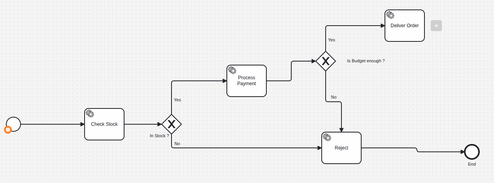

# Order Process BPMN

A Spring Boot application that orchestrates an order fulfillment workflow using **Camunda 8 (SaaS)** as the process engine, with job workers implemented in Java to handle stock checks, payment processing, and delivery.

## Architecture / Workflow Diagram

```


```

The diagram above shows the full `order-process` flow: stock check → payment → delivery, with rejection paths when stock or funds are insufficient.

---

## Tech Stack

- **Java / Spring Boot** – REST API, business logic, job workers
- **Camunda 8 (SaaS)** – BPMN process engine / orchestration
- **MySQL** – persistence for `User`, `Product`, and `Order` entities
- **Hibernate / Spring Data JPA** – ORM layer
- **Lombok** – boilerplate reduction

---

## 1. Setting Up the Camunda Cluster

1. Created an account on **Camunda SaaS** (console.cloud.camunda.io).
2. Created a new cluster named **`Order-process`** in region **`bru-2`**.
3. Under the cluster's **API** tab, created a new API client (**`order-process-java`**) with scopes: **Orchestration, Optimize, and Secrets**.
4. From the client's connection details page, copied the values needed to connect a Java client:
   - `Cluster Id`
   - `Region Id`
   - `Client Id` / `Client Secret`
   - `Camunda REST API` base URL

---

## 2. Designing the Process (BPMN)

Modeled the workflow in **Camunda Desktop Modeler** as a process with BPMN process ID **`order-process`**, consisting of:

| Step | Type | Job type |
|---|---|---|
| Check Stock | Service Task | `check-stock` |
| Gateway: Is stock available? | Exclusive Gateway | — |
| Process Payment | Service Task | `process-payment` |
| Gateway: Is payment successful? | Exclusive Gateway | — |
| Deliver Order | Service Task | `deliver-order` |
| Reject Order | Service Task | `reject-order` |

Gateway conditions are written in **FEEL** (not Java/JS syntax), e.g.:
- `isStockAvailable` / `not(isStockAvailable)`
- `paymentSuccessful` / `not(paymentSuccessful)`

Process variables passed in at start: `userId`, `productId`, `quantity`.

The finished model was deployed to the SaaS cluster from Camunda Modeler (**Deploy** button, connected to the `bru-2` / `order-process-java` cluster credentials).

---

## 3. Connecting the Spring Boot App to Camunda

### `application.properties`

```properties
camunda.client.mode=saas
camunda.client.auth.client-id=${CAMUNDA_CLIENT_ID}
camunda.client.auth.client-secret=${CAMUNDA_CLIENT_SECRET}
camunda.client.cloud.cluster-id=${CAMUNDA_CLUSTER_ID}
camunda.client.cloud.region=bru-2
```

> Credentials are injected via environment variables — never committed to the repository.

The `camunda-spring-boot-starter` dependency auto-configures a `CamundaClient` bean, injected wherever needed.

### Starting a Process Instance

`OrderProcessController` exposes a REST endpoint that kicks off the workflow:

```
POST /orders?userId={id}&productId={id}&quantity={n}
```

which delegates to `OrderProcessService`, calling:

```java
camundaClient.newCreateInstanceCommand()
    .bpmnProcessId("order-process")
    .latestVersion()
    .variables(variables)
    .send()
    .join();
```

### Job Workers

Each BPMN service task is backed by a `@JobWorker`-annotated Spring bean that Camunda invokes automatically over the client's long-polling job activation:

| Worker class | Job type | Responsibility |
|---|---|---|
| `CheckStockWorker` | `check-stock` | Verifies product stock availability |
| `PaymentWorker` | `process-payment` | Deducts funds from user budget if sufficient |
| `DeliveryWorker` | `deliver-order` | Finalizes stock deduction and records a successful `Order` |
| `RejectOrderWorker` | `reject-order` | Records a failed `Order` when stock/payment checks fail |

Each worker reads process variables via `@Variable`, performs its business logic against the MySQL database (via Spring Data JPA repositories), and returns a `Map<String, Object>` of output variables that Camunda merges back into the process instance — driving the next gateway decision.

---

## 4. Database

- `User` – holds each user's available budget
- `Product` – holds stock quantity and unit price
- `Order` – records the outcome of each order attempt (`isSuccessful`, `paidAmount`, linked `User`)

> Note: `Order` is mapped with `@Table(name = "orders")` since `order` is a reserved SQL keyword.

Schema is managed via `spring.jpa.hibernate.ddl-auto=update` for local development.

---

## 5. Running Locally

1. Start MySQL and ensure `bpmn_order_processing` database exists.
2. Set required environment variables: `CAMUNDA_CLIENT_ID`, `CAMUNDA_CLIENT_SECRET`, `CAMUNDA_CLUSTER_ID`, `DB_PASSWORD` (etc).
3. Run the Spring Boot application.
4. Trigger a new order:
   ```bash
   curl -X POST "http://localhost:8080/orders?userId=1&productId=1&quantity=3"
   ```
5. Monitor the running instance in **Camunda Operate** (linked from the cluster's connection info) to watch it move through the gateways in real time.

---

## Security Notes

- Camunda client credentials and DB credentials are supplied via environment variables, not committed to source control.
- Rotate any credentials immediately if they are ever exposed (e.g. shared in logs, chat, or version control).
